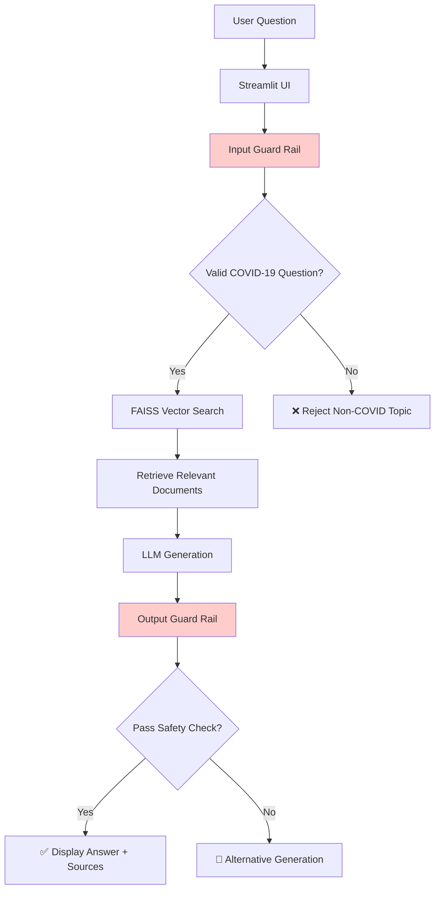

# 🦠 COVID-19 Indonesia Chatbot

<div align="center">

*AI-powered information assistant for COVID-19 in Indonesia*

[](https://streamlit.io/)
[](https://python.org)
[](https://faiss.ai)
[](https://arxiv.org/abs/2005.11401)

**Accurate • Safe • Indonesia-Focused**

</div>

## 📖 Overview

**COVID-19 Indonesia Chatbot** is an intelligent AI assistant that provides reliable information about COVID-19 specifically for Indonesia. Built with Retrieval-Augmented Generation (RAG) technology, it ensures all answers are grounded in official government documents and trusted local sources - **no AI hallucinations or unverified information**.

### 🎯 Key Features

- 💬 **Smart Q&A** - Natural conversations about COVID-19 Indonesia
- 🛡️ **Safety First** - Multi-layer guard rails against misinformation
- 📚 **Source-Verified** - Every answer traceable to original documents
- 🔍 **Semantic Search** - Finds relevant information across thousands of documents
- 💾 **Multi-Chat System** - Organized conversation management
- ⚡ **Real-time Processing** - Fast responses under 3 seconds

## 🏗️ Architecture



## 🚀 Quick Start

### Prerequisites

- Python 3.8+
- Ollama (for local LLM)
- Git

### Installation

1. **Clone the repository**
   ```bash
   git clone https://github.com/your-username/covid19-indonesia-chatbot.git
   cd covid19-indonesia-chatbot
   ```

2. **Install dependencies**
   ```bash
   pip install -r requirements.txt
   ```

3. **Set up Ollama**
   ```bash
   # Install Ollama
   curl -fsSL https://ollama.ai/install.sh | sh
   
   # Pull the language model
   ollama pull gemma:2b
   ```

4. **Prepare knowledge base**
   ```bash
   # Place your COVID-19 documents in the faiss/ directory
   python create_embeddings.py
   ```

5. **Launch the application**
   ```bash
   streamlit run app.py
   ```

## 📁 Project Structure

```
covid19-indonesia-chatbot/
├── src/                    # Core AI components
│   ├── retriever.py       # FAISS vector search
│   ├── generation.py      # LLM integration & response generation
│   ├── guard_rail.py      # Safety & content filtering
│   └── config.py          # Configuration management
├── pages/                 # Streamlit application pages
│   ├── 01_chat.py        # Main chat interface
│   ├── 02_retrieval_debug.py  # Debug & monitoring
│   ├── 03_config_tester.py    # Configuration testing
│   └── 04_clear_cache.py      # Cache management
├── faiss/                # Vector database & documents
│   ├── faiss_textcovid19.index
│   └── faiss_textcovid19_texts.json
├── data/                 # Chat history & user data
├── app.py               # Main application entry
└── requirements.txt     # Python dependencies
```

## 💡 Usage Examples

### Medical Information
**Q:** "Apa gejala COVID-19 dan berapa lama isolasi mandiri?"  
**A:** "Berdasarkan dokumen, gejala umum: demam, batuk kering, kelelahan, hilang penciuman/rasa. Isolasi mandiri: 10-14 hari untuk gejala ringan."

### Vaccination Program
**Q:** "Kapan vaksinasi COVID-19 dimulai di Indonesia?"  
**A:** "Program vaksinasi nasional dimulai Januari 2021, dengan Presiden Joko Widodo sebagai penerima pertama vaksin Sinovac pada 13 Januari 2021."

### Government Policies
**Q:** "Apa perbedaan PSBB dan PPKM?"  
**A:** "PSBB (Pembatasan Sosial Berskala Besar) diterapkan awal pandemi, sedangkan PPKM (Pemberlakuan Pembatasan Kegiatan Masyarakat) dengan level berbeda sesuai kondisi daerah."

## 🛡️ Safety Features

### Content Filtering
- **50+ COVID-19 keywords** for topic validation
- **30+ rejected topics** (food, entertainment, politics, etc.)
- **Emergency shutdown** for dangerous content
- **Context consistency** checking

### Quality Assurance
- **Zero hallucination** - Only document-based answers
- **Source attribution** - Full transparency
- **Multi-stage validation** - Input & output guard rails
- **Fallback mechanisms** - Graceful error handling

## ⚙️ Configuration

Key settings in `src/config.py`:

```python
MODEL_CONFIG = {
    "embedding_model": "paraphrase-multilingual-mpnet-base-v2",
    "generation_model": "gemma:2b",
    "retrieval_top_k": 15,
    "score_threshold": 0.2,
    "language": "id"
}
```

## 🧪 Testing

The chatbot includes comprehensive testing tools:

```bash
# Access testing interface
streamlit run pages/02_retrieval_debug.py

# Test configuration
streamlit run pages/03_config_tester.py

# Clear cache if needed
streamlit run pages/04_clear_cache.py
```

### Test Categories
- ✅ **Accuracy** - Information correctness
- ✅ **Consistency** - Same answers for similar questions  
- ✅ **Safety** - Content filtering effectiveness
- ✅ **Performance** - Response time & latency
- ✅ **User Experience** - Interface usability

## 🎯 Supported Topics

- 🏥 **Medical Information** - Symptoms, prevention, treatment
- 💉 **Vaccination** - Programs, types, schedules
- 📊 **Statistics** - Cases, recovery rates, trends
- 🏛️ **Government Policies** - PSBB, PPKM, travel requirements
- 💰 **Economic Support** - Social assistance, UMKM programs
- 🧠 **Mental Health** - Counseling, support services
- 📱 **Technology** - PeduliLindungi, telemedicine
- 🎓 **Education** - Remote learning, digital literacy

## 🤝 Contributing

We welcome contributions! Please see our [Contributing Guidelines](CONTRIBUTING.md) for details.

1. Fork the repository
2. Create a feature branch (`git checkout -b feature/amazing-feature`)
3. Commit your changes (`git commit -m 'Add amazing feature'`)
4. Push to the branch (`git push origin feature/amazing-feature`)
5. Open a Pull Request

## 📄 License

This project is licensed under the MIT License - see the [LICENSE](LICENSE) file for details.

## 🙏 Acknowledgments

- **Indonesian Government** for COVID-19 documentation
- **Streamlit** for the amazing web framework
- **Facebook AI** for FAISS vector search
- **Ollama** for local LLM management
- **Sentence Transformers** for multilingual embeddings

## 📞 Support

For support and questions:
- 📧 Email: your-email@domain.com
- 🐛 [Issue Tracker](https://github.com/your-username/covid19-indonesia-chatbot/issues)
- 💬 [Discussions](https://github.com/your-username/covid19-indonesia-chatbot/discussions)

## 🏥 Disclaimer

This chatbot provides information based on official documents but does not replace professional medical advice. For medical emergencies, please contact healthcare providers directly.

---

<div align="center">

**Built with ❤️ for Indonesia**

*Helping fight misinformation during the COVID-19 pandemic*

</div>